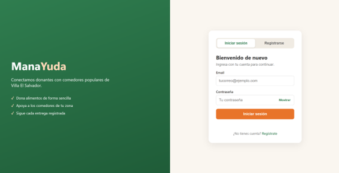
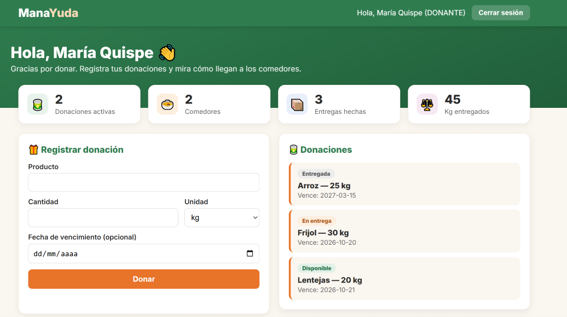

# ManayudaApp 🍲

Plataforma web que conecta **donantes** con **comedores populares** de Villa El Salvador (Lima, Perú). Los donantes registran alimentos y los comedores los reciben, con control de saldo, vencimiento y estados.

## Capturas

### Inicio de sesión y registro

### Panel principal

## Funcionalidades

- Registro e inicio de sesión con contraseñas encriptadas (BCrypt).
- Roles: donante y comedor, cada uno con su vista del panel.
- Los comedores registran su información y reciben donaciones.
- Los donantes registran donaciones con cantidad, unidad y fecha de vencimiento.
- Entregas parciales: cada entrega descuenta el saldo y la donación pasa de `DISPONIBLE` a `ASIGNADA` y luego a `ENTREGADA`.
- Validaciones: no se entrega más de lo que queda, ni una donación vencida o ya entregada.
- Las donaciones vencidas dejan de mostrarse en los listados.
- Panel con estadísticas: donaciones activas, comedores, entregas y kilos entregados.

## Tecnologías

- Java 17+ y Spring Boot (Web, Data JPA, Validation)
- MySQL 8
- Lombok y Spring Security Crypto (BCrypt)
- HTML, CSS y JavaScript

## Arquitectura

Capas: `controller` → `service` → `repository` → MySQL. Se usan DTOs para no exponer las entidades; por ejemplo, el hash de la contraseña nunca sale en las respuestas.

## Cómo ejecutarlo

1. Clona el repositorio.
2. Crea la base de datos con el script `database/manayuda.sql`.
3. Copia `src/main/resources/secrets.properties.example` como `secrets.properties` y pon tus credenciales de MySQL.
4. Ejecuta `ManayudaApplication` desde tu IDE o con `./mvnw spring-boot:run`.
5. Abre `http://localhost:8080` y crea una cuenta desde la pantalla de registro.

## Endpoints principales

| Método | Ruta | Descripción |
|--------|------|-------------|
| POST | `/api/auth/login` | Iniciar sesión |
| GET/POST | `/api/usuarios` | Listar / registrar usuarios |
| GET/POST | `/api/comedores` | Listar / crear comedores |
| GET/POST | `/api/donaciones` | Listar (filtro `?estado=`) / crear donaciones |
| GET/POST | `/api/entregas` | Listar (filtro `?idComedor=`) / registrar entregas |

## Limitaciones conocidas y próximos pasos

- La sesión se guarda en el navegador y el servidor aún confía en el `idUsuario` que recibe. El siguiente paso es autenticación con Spring Security y JWT.
- Rol de administrador.
- Editar y eliminar registros.
- Recuperación de contraseña.
- Pruebas automáticas y despliegue en la nube.

## Autor

**Angel Oscar Moscoso Huaman**, estudiante de Ingeniería de Software (UTP).

- GitHub: [AngelHuaman13](https://github.com/AngelHuaman13)
- Correo: mangel.roben@gmail.com